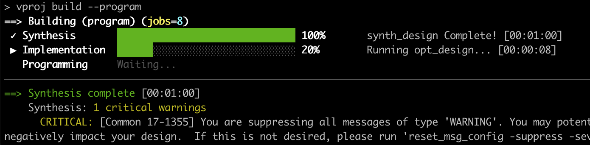

# Verilog Playground

A learning project for Verilog/SystemVerilog development targeting the Digilent Nexys A7 (Artix-7 FPGA).

## Requirements

- Vivado 2025.1
- [pixi](https://pixi.sh) for Python environment management
- verilator (for linting and simulation)

## Quick Start

```bash
# Set up environment
pixi shell

# Import Vivado project from TCL
vproj import-tcl project.tcl

# List project files
vproj ls

# Lint/syntax check
vproj check

# Build bitstream
vproj build

# Program FPGA
vproj program
```

## Project Structure

```
src/
  sources/           # RTL source files (.sv)
  constraints/       # Constraint files (.xdc)
  testbench/         # Testbench files
tests/               # Python/cocotb testbenches
scripts/vproj/       # vproj CLI tool
project.tcl          # Vivado project definition
```

## vproj

`vproj` is a CLI tool for Verilog/FPGA development that lets you use your favorite editor and terminal while maintaining Vivado project files and build infrastructure.



### Key Commands

| Command | Description |
|---------|-------------|
| `vproj info` | Show project info |
| `vproj ls` | List project files |
| `vproj check` | Lint with Verilator |
| `vproj build` | Build bitstream |
| `vproj program` | Program FPGA |
| `vproj import-tcl <file>` | Import project from TCL |
| `vproj export-tcl` | Export project to TCL |

Run `vproj --help` for full command list.

### TCL Import/Export

Keep Vivado project files out of git:

```bash
# After cloning - recreate project
vproj import-tcl project.tcl

# Before committing - export changes
vproj export-tcl
```

### Server Mode

Eliminate Vivado startup overhead (~15s per command to instant):

```bash
vproj server start   # Start persistent Vivado process
vproj ls             # Instant
vproj server stop    # Stop when done
```

## Testing

Tests use cocotb + verilator + pytest:

```bash
pixi run pytest
```

## License

MIT
